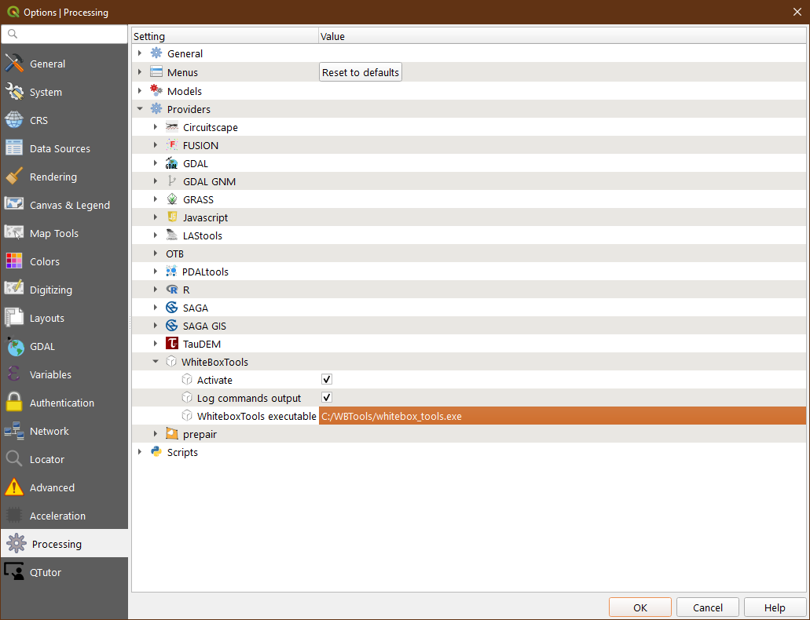
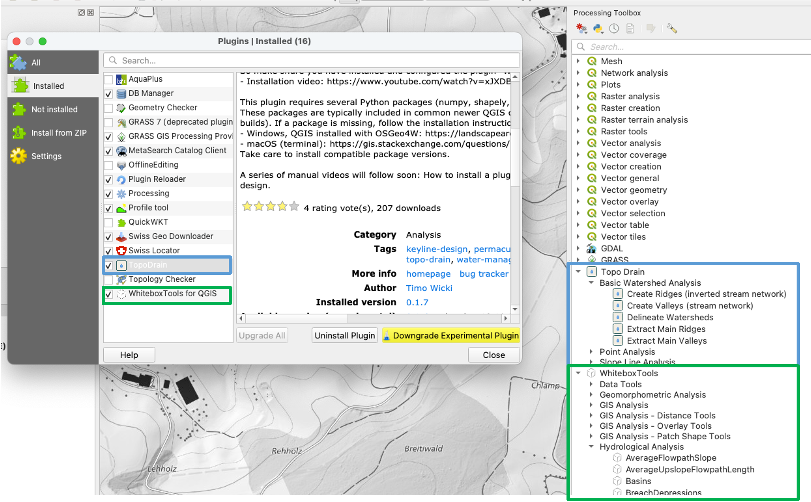

# TopoDrain-plugin
A QGIS plugin for planning surface drainage water management. It automates the extraction of main valleys and ridges, and supports water retention planning methods, such as Keyline Design (keypoints, keylines). The algorithms are mainly based on WhiteboxTools (Lindsay, 2017–2020)

⚠️  DISCLAIMER: Managing surface runoff is a complex process influenced by topography, soil properties, farmland management practices, and other factors. This tool supports experienced users in planning and analysis and should be applied iteratively alongside expert judgment and complementary planning tools.

## Table of Contents
- [Installation Guide](#installation-guide)
  - [Installing QGIS](#installing-qgis)
    - [Windows Installation](#windows-installation)
    - [macOS Installation](#macos-installation)
  - [Python Dependencies](#python-dependencies)
  - [Installing and Configuring WhiteboxTools for QGIS](#installing-and-configuring-whiteboxtools-for-qgis)
    - [Step 1: Download WhiteboxTools](#step-1-download-whiteboxtools)
    - [Step 2: Install the WhiteboxTools QGIS Plugin](#step-2-install-the-whiteboxtools-qgis-plugin)
    - [Step 3: Configure the WhiteboxTools Provider](#step-3-configure-the-whiteboxtools-provider)
    - [Verify Installation](#verify-installation)
  - [Installing the TopoDrain Plugin](#installing-the-topodrain-plugin)
- [Recommended QGIS Plugins](#recommended-qgis-plugins)
  - [Profile Tool](#profile-tool)
  - [For Users in Switzerland: Swiss Geo Downloader](#for-users-in-switzerland-swiss-geo-downloader)
- [Documentation and Tutorials](#documentation-and-tutorials)
  - [Keyline Design Manual](#keyline-design-manual)
  - [Create Constant Slope Lines Manual](#create-constant-slope-lines-manual)
  - [Delineate Watersheds Manual](#delineate-watersheds-manual)
## Installation Guide

### Installing QGIS

It's recommended installing the newest **QGIS LTR (Long Term Release)** version to ensure stability and compatibility with the TopoDrain plugin.

#### Windows Installation
The best way to install QGIS on Windows is using the **OSGeo4W Network Installer**:
1. Download the OSGeo4W installer from [qgis.org](https://qgis.org/resources/installation-guide/)
2. Run the installer and follow the setup wizard
3. Select the QGIS LTR version during installation

#### macOS Installation
For macOS, install QGIS using the **DMG installer**:
1. Download the DMG file "Long Term Version for maxOS" from [qgis.org](https://qgis.org/download/)
2. Open the DMG file and drag QGIS to your Applications folder
3. Launch QGIS from your Applications

### Python Dependencies
The TopoDrain plugin requires several Python packages: `numpy`, `pandas`, `geopandas`, `shapely`, `scipy`. While these packages are widely used in geospatial data processing, not all of them are included in the default QGIS installation (particularly `pandas`, `geopandas`, and `scipy` could be missing). 

**If a package is missing in your QGIS installation:**

#### Windows (OSGeo4W installation)

**Method 1: Using OSGeo4W Shell (Recommended)**
1. Open the **OSGeo4W Shell** as Administrator (search for "OSGeo4W Shell" in Start menu, right-click → Run as administrator)
2. Install the missing packages using pip:
   ```bash
   python -m pip install pandas
   python -m pip install geopandas
   python -m pip install scipy
   ```
3. Restart QGIS after installation

**Note:** If you encounter issues with `python`, try using `python3` instead:
```bash
python3 -m pip install pandas geopandas scipy
```

**Method 2: Using OSGeo4W Setup Installer**
- Run the OSGeo4W Setup installer (`osgeo4w-setup.exe`)
- Search for and select the missing Python packages
- Complete the installation wizard

**Additional Resources:**
- Detailed guide: https://landscapearchaeology.org/2018/installing-python-packages-in-qgis-3-for-windows/

#### macOS (Terminal-based installation)

1. Open Terminal
2. Find your QGIS Python path (most likely `/Applications/QGIS-LTR.app/Contents/MacOS/bin/python3` or `/Applications/QGIS.app/Contents/MacOS/bin/python3`)
3. Use pip to install missing packages:
   ```bash
   /Applications/QGIS-LTR.app/Contents/MacOS/bin/python3 -m pip install pandas geopandas scipy
   ```
   Or for the regular QGIS version:
   ```bash
   /Applications/QGIS.app/Contents/MacOS/bin/python3 -m pip install pandas geopandas scipy
   ```
4. Restart QGIS after installation

**Additional Resources:**
- Detailed guide: https://gis.stackexchange.com/questions/351280/installing-python-modules-for-qgis-3-on-mac

### Installing and Configuring WhiteboxTools for QGIS

The TopoDrain plugin depends on **WhiteboxTools for QGIS**. You need to install both the WhiteboxTools executable and the QGIS plugin, then configure the connection.

📺 **Watch the installation video:** https://www.youtube.com/watch?v=xJXDBsNbcTg

#### Step 1: Download WhiteboxTools
1. Download the WhiteboxTools executable from the official repository https://www.whiteboxgeo.com/download-direct/
2. Extract the files to an appropriate location on your machine - for example:
   - **Windows:** `C:\WBTools\`
   - **macOS:** `/Library/WhiteboxTools_darwin_m_series/WBT/`

#### Step 2: Install the WhiteboxTools QGIS Plugin
1. Open QGIS
2. Go to **Plugins → Manage and Install Plugins**
3. Search for "WhiteboxTools for QGIS"
4. Click **Install Plugin**

#### Step 3: Configure the WhiteboxTools Provider
1. In QGIS, go to **Settings → Options → Processing → Providers**
2. Expand the **WhiteboxTools** section
3. Set the **WhiteboxTools executable** path:
   - **Windows:** `C:\WBTools\whitebox_tools.exe`
   - **macOS:** `/Library/WhiteboxTools_darwin_m_series/WBT/whitebox_tools` (without `.exe`)



#### Verify Installation
To verify that WhiteboxTools is properly configured:
1. Open the **Processing Toolbox** (Processing → Toolbox)
2. Look for the **WhiteboxTools** section
3. Test for instance the processing tool **ContoursFromRaster** if it works

### Installing the TopoDrain Plugin

#### Install TopoDrain from the QGIS Plugin Repository
1. In QGIS, go to **Plugins → Manage and Install Plugins**
2. In the **All** tab and search for **"TopoDrain"**
3. Select the TopoDrain plugin and click **Install Plugin**
   - Make sure to install the newest version (at least version ≥0.1.10)

After installation, you will see TopoDrain tools in the **Processing Toolbox** under the TopoDrain section.



## Recommended QGIS Plugins

### Profile Tool
The **Profile tool** plugin is highly recommended for verifying results created with TopoDrain tools. It allows you to plot terrain profiles, which is essential for checking the slope of created keylines respectively constant slope lines.

**Installation:** Go to **Plugins → Manage and Install Plugins**, search for "Profile tool", and click **Install Plugin**.

### For Users in Switzerland: Swiss Geo Downloader
The **Swiss Geo Downloader** plugin is useful for downloading Digital Terrain Data (swissALTI3D) and other data directly within QGIS:
1. Install the plugin from **Plugins → Manage and Install Plugins**
2. Open the plugin: **Plugins → Swiss Geo Downloader**
3. Search for dataset **swissALTI3D**
4. Request file list
5. Choose best resolution!
6. Download tiles for your study site (TIF files)
7. Use the GDAL **"Merge"** tool to combine multiple tiles into a single TIF file

## Documentation and Tutorials

### Keyline Design Manual
A comprehensive step-by-step tutorial for creating a Keyline Design using the TopoDrain plugin tools is available:

📖 **[Keyline Design Manual](docs/Keyline-Design.md)**

This tutorial covers:
- DTM preprocessing and terrain visualization
- Creating and extracting valleys and ridges
- Defining study area perimeters
- Identifying keypoints and start points
- Creating keylines with constant slopes
- Creating parallel lines for agroforestry or traffic patterns
- Final considerations for real-world implementation

### Create Constant Slope Lines Manual
A tutorial demonstrating how to create **constant slope lines** and **zig-zag patterns** for water management applications:

📖 **[Create Constant Slope Lines Manual](docs/Create-Constant-Slope-Lines.md)**

This tutorial covers:
- Creating single constant slope lines from start points to destinations
- Using barriers to guide lines and create zig-zag patterns
- Handling challenging terrain with intermediate stopover points
- Verification with elevation profiles
- **Directing water flow** to specific destinations (ponds, irrigation systems)
- Designing **paths or routes** with consistent slopes

### Delineate Watersheds Manual
A tutorial demonstrating how to delineate watersheds (drainage basins) for water resource management:

📖 **[Delineate Watersheds Manual](docs/Delineate-Watersheds.md)**

This tutorial covers:
- Preparing DTM with stream burning for accurate delineation
- Creating valley networks from burned terrain models
- Defining pour points (watershed outlets)
- Automated watershed boundary delineation