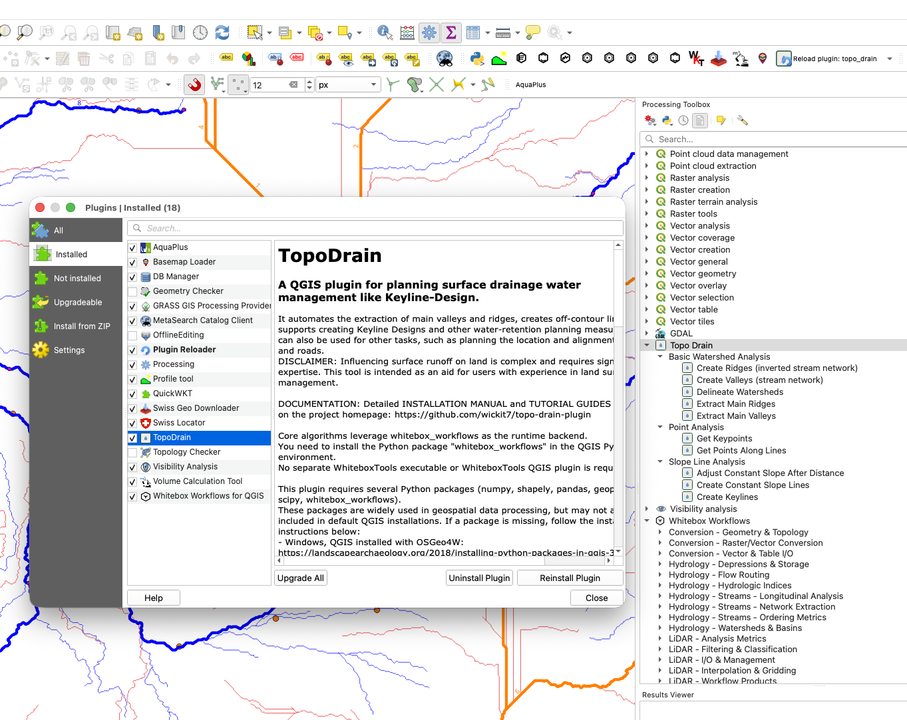

# TopoDrain-plugin
A QGIS plugin for planning surface drainage water management. It automates the extraction of main valleys and ridges, and supports water retention planning methods, such as Keyline Design (keypoints, keylines). The algorithms are mainly based on whitebox_workflows as the runtime backend.

⚠️  DISCLAIMER: Managing surface runoff is a complex process influenced by topography, soil properties, farmland management practices, and other factors. This tool supports experienced users in planning and analysis and should be applied iteratively alongside expert judgment and complementary planning tools.

**Tested with:** QGIS 3.44.8-Solothurn · Python 3.12.11 · GDAL 3.12.0 (Chicoutimi)

## Table of Contents
- [Installation Guide](#installation-guide)
  - [Installing QGIS](docs/Installing-QGIS.md)
  - [Python Dependencies](docs/Python-Dependencies.md)
   - [Installing whitebox_workflows](#installing-whitebox_workflows)
    - [Verify Installation](#verify-installation)
  - [Installing the TopoDrain Plugin](#installing-the-topodrain-plugin)
- [Recommended QGIS Plugins](#recommended-qgis-plugins)
  - [Profile Tool](#profile-tool)
  - [For Users in Switzerland: Swiss Geo Downloader](#for-users-in-switzerland-swiss-geo-downloader)
- [Documentation and Tutorials](#documentation-and-tutorials)
  - [Keyline Design Manual](#keyline-design-manual)
  - [Create Constant Slope Lines Manual](#create-constant-slope-lines-manual)
  - [Delineate Watersheds Manual](#delineate-watersheds-manual)
## Installation Guide

### Installing QGIS

See [Installing QGIS](docs/Installing-QGIS.md) for platform-specific instructions.

### Python Dependencies

The plugin requires `numpy`, `pandas`, `geopandas`, `shapely`, `scipy`, and `whitebox_workflows`. See [Python Dependencies](docs/Python-Dependencies.md) for platform-specific installation instructions.

### Installing whitebox_workflows

TopoDrain uses **whitebox_workflows** as its runtime backend.

**Recommended: install the [Whitebox Workflows for QGIS](https://plugins.qgis.org/plugins/whitebox_workflows_for_qgis/) plugin** via **Plugins → Manage and Install Plugins**. It will guide you through installing the `whitebox_workflows` Python package and verifies the setup automatically.

Alternatively, install the package manually into the same Python environment that QGIS uses:

#### Windows (OSGeo4W installation)
```bash
python -m pip install whitebox_workflows
```

#### macOS
```python
from pip._internal.cli.main import main
main(["install", "whitebox_workflows"])
```

After installation, restart QGIS and run a TopoDrain tool once to let the runtime initialize.

### Installing the TopoDrain Plugin

#### Install TopoDrain from the QGIS Plugin Repository
1. In QGIS, go to **Plugins → Manage and Install Plugins**
2. In the **All** tab and search for **"TopoDrain"**
3. Select the TopoDrain plugin and click **Install Plugin**
   - Make sure to install the newest available version from the repository

After installation, you will see TopoDrain tools in the **Processing Toolbox** under the TopoDrain section.



## Recommended QGIS Plugins

### Profile Tool
The **Profile tool** plugin is highly recommended for verifying results created with TopoDrain tools. It allows you to plot terrain profiles, which is essential for checking the slope of created keylines respectively constant slope lines.

**Installation:** Go to **Plugins → Manage and Install Plugins**, search for "Profile tool", and click **Install Plugin**.

### For Users in Switzerland: Swiss Geo Downloader
The **Swiss Geo Downloader** plugin is useful for downloading Digital Terrain Data (swissALTI3D) and other data directly within QGIS:
1. Install the plugin from **Plugins → Manage and Install Plugins**
2. Open the plugin: **Plugins → Swiss Geo Downloader**
3. Search for dataset **swissALTI3D**
4. Request file list
5. Choose best resolution!
6. Download tiles for your study site (TIF files)
7. Use the GDAL **"Merge"** tool to combine multiple tiles into a single TIF file

## Documentation and Tutorials

### Keyline Design Manual
A comprehensive step-by-step tutorial for creating a Keyline Design using the TopoDrain plugin tools is available:

📖 **[Keyline Design Manual](docs/Keyline-Design.md)**

This tutorial covers:
- DTM preprocessing and terrain visualization
- Creating and extracting valleys and ridges
- Defining study area perimeters
- Identifying keypoints and start points
- Creating keylines with constant slopes
- Creating parallel lines for agroforestry or traffic patterns
- Final considerations for real-world implementation

### Create Constant Slope Lines Manual
A tutorial demonstrating how to create **constant slope lines** and **zig-zag patterns** for water management applications:

📖 **[Create Constant Slope Lines Manual](docs/Create-Constant-Slope-Lines.md)**

This tutorial covers:
- Creating single constant slope lines from start points to destinations
- Using barriers to guide lines and create zig-zag patterns
- Handling challenging terrain with intermediate stopover points
- Verification with elevation profiles
- **Directing water flow** to specific destinations (ponds, irrigation systems)
- Designing **paths or routes** with consistent slopes

### Delineate Watersheds Manual
A tutorial demonstrating how to delineate watersheds (drainage basins) for water resource management:

📖 **[Delineate Watersheds Manual](docs/Delineate-Watersheds.md)**

This tutorial covers:
- Preparing DTM with stream burning for accurate delineation
- Creating valley networks from burned terrain models
- Defining pour points (watershed outlets)
- Automated watershed boundary delineation