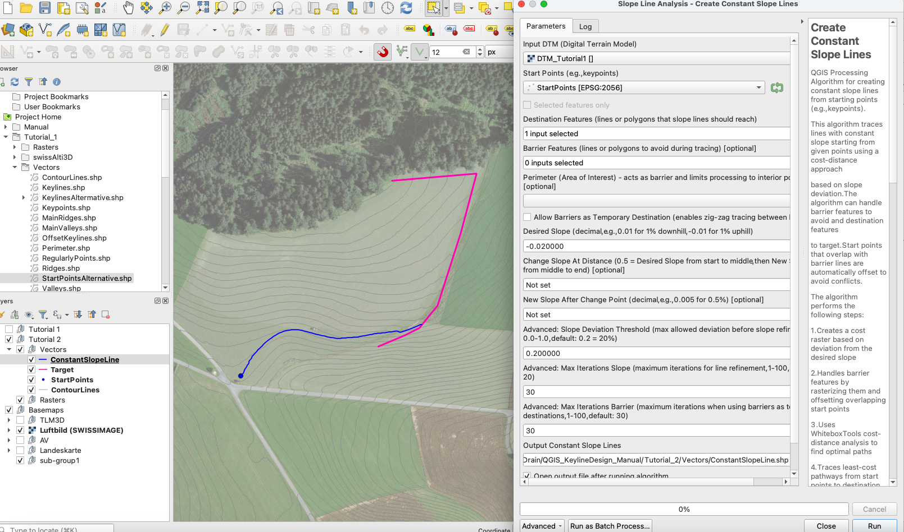
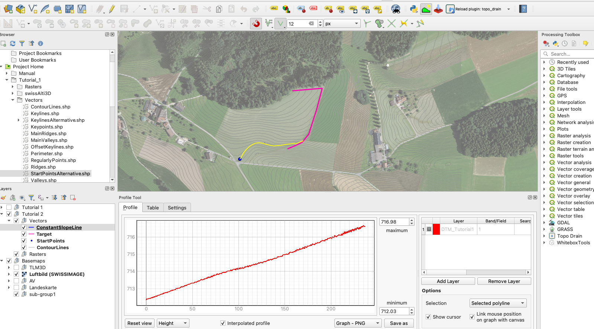
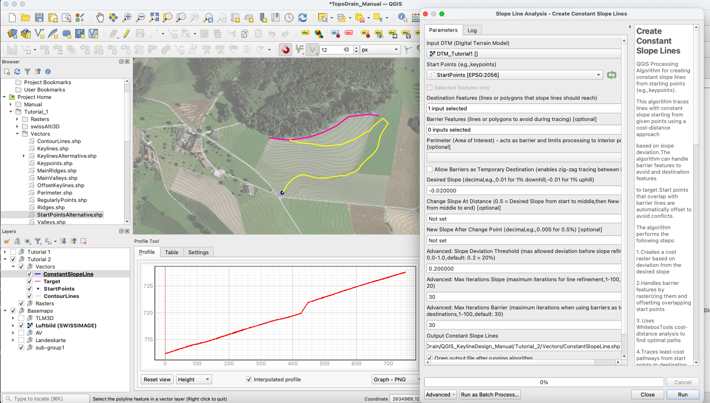
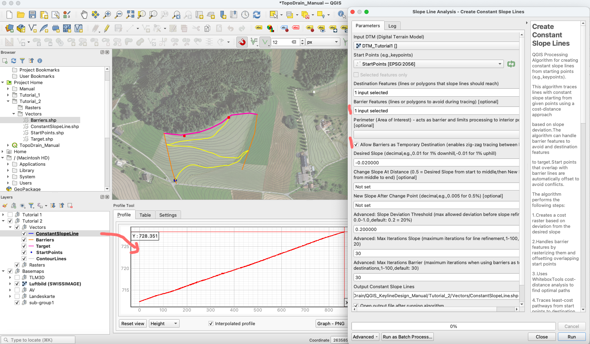

# Create Constant Slope Lines and Zig-Zag Constant Slope Lines

This tutorial demonstrates how to create constant slope lines for water management applications, such as directing water to ponds, irrigation systems, or other specific destinations.

> **Prerequisites**: Before starting this tutorial, you should have:
> - Completed the installation of QGIS, WhiteboxTools, and the TopoDrain plugin (see [Installation Guide in README.md](../README.md#installation-guide))
> - A preprocessed Digital Terrain Model (DTM) - see [DTM Preprocessing in Keyline-Design.md](Keyline-Design.md#dtm-preprocessing)
> - Basic understanding of terrain characteristics - optionally review [Creating Valleys and Ridges in Keyline-Design.md](Keyline-Design.md#creating-valleys-and-ridges)

## Table of Contents
- [Overview](#overview)
- [Create Constant Slope Line](#create-constant-slope-line)
- [Create Zig-Zag Constant Slope Lines](#create-zig-zag-constant-slope-lines)

---

## Overview

Constant slope lines are linear features that maintain a specific gradient across the terrain. They are useful for:
- **Directing water flow** to specific destinations (ponds, irrigation systems)
- Creating open drainage channels with controlled gradients
- Designing **paths or routes** with consistent slopes

Unlike keylines (which form a network pattern between valleys and ridges), constant slope lines are typically single lines traced from a start point to a destination feature.

---

## Create Constant Slope Line

This section demonstrates how to create a single constant slope line from a start point to a target destination.

### Step 1: Prepare Input Layers

#### Create Start Points Layer

1. In the **Browser panel** of QGIS, navigate to **Project Home** → your vectors folder (e.g., `Vectors`)
2. Right-click and select **New** → **ShapeFile**
3. Configure:
   - **File name**: `StartPoints`
   - **Geometry type**: **Point**
   - **CRS**: Match your DTM/project CRS
4. Click **OK**
5. Toggle editing mode and add a start point at your desired location
   - **Example**: Place the point at the inflow location of a pond where you want to direct water to
6. Save edits

#### Create Target Layer

1. In the **Browser panel**, create another shapefile
2. Configure:
   - **File name**: `Target`
   - **Geometry type**: **Line**
   - **CRS**: Match your DTM/project CRS
3. Click **OK**
4. Toggle editing mode and digitize a target line where you want the water to come from
   - **Example**: Draw a line along the upper field boundary where water enters your area
5. Save edits

#### Optional: Create Perimeter Layer

If you want to constrain the analysis to a specific area:

1. Create a new shapefile:
   - **File name**: `Perimeter`
   - **Geometry type**: **Polygon**
   - **CRS**: Match your DTM/project CRS
2. Digitize a polygon around your area of interest
3. Save edits

#### Optional: Create Barriers Layer

If you have features that the constant slope line should not cross:

1. Create a new shapefile:
   - **File name**: `Barriers`
   - **Geometry type**: **Line**
   - **CRS**: Match your DTM/project CRS
2. Digitize barrier lines (e.g., roads, existing infrastructure, property boundaries)
3. Save edits

### Step 2: Run Create Constant Slope Lines Tool

The **Create Constant Slope Lines** tool traces lines with constant slope from starting points to destination features using a cost-distance approach based on slope deviation.

#### How the Tool Works

The algorithm creates a cost raster based on (Euclidean) distance and the expected slope (Desired Slope) for constant slope line tracing. It uses WhiteboxTools processes like **CostDistance** and **CostPathway** to determine the optimal path from start points toward destination features. If the length of the traced line exceeds the Euclidean distance such that the expected slope exceeds the **Slope Deviation Threshold**, a new iteration is started from the point where this condition was violated. Optional barrier features are rasterized with infinite cost values to prevent line crossing, and start points overlapping with barriers are automatically offset.

#### Open the Tool
Open the **Processing Toolbox** in QGIS and then the tool **"Create Constant Slope Lines"** from the TopoDrain provider

#### Parameters

**Required Parameters:**

- **Input DTM (Digital Terrain Model)**
  - Select your preprocessed DTM raster layer
  - This provides elevation data for slope calculations

- **Start Points**
  - Select your `StartPoints` layer
  - These are the locations where constant slope lines will begin
  - In this example: Point at the pond inflow location

- **Destination Features**
  - Select one or more line or polygon layers representing target destinations
  - The algorithm will trace paths from start points toward these features
  - In this example: Select the `Target` line layer (field boundary)
  - You can add multiple destination layers

- **Desired Slope**
  - Enter the target slope as a decimal value
  - Positive values = downhill slope (water flows toward destination)
  - Negative values = uphill slope (not typical for water conveyance)
  - ⚠️ **Example**: `-0.02` = 2% uphill gradient
  - **Note**: The algorithm attempts to maintain this slope but may deviate slightly based on terrain

**Optional Parameters:**

- **Barrier Features**
  - Optional: Select one or more line or polygon layers representing features to avoid
  - The constant slope line will not cross these barriers
  - In this example: Leave empty (no barriers)
  - Examples: Roads, existing infrastructure, property lines

- **Perimeter (Area of Interest)**
  - Optional: Polygon layer defining the study area boundary
  - Constrains analysis and output to this region
  - Leave empty to use full DTM extent

- **Allow Barriers as Temporary Destination**
  - Boolean option (default: False)
  - When True: If no destination is reached with the desired slope, the line can stopover at a barrier
  - When False: Line must reach an actual destination feature (maybe will not be able to create constant slope line)
  - In this example: **Uncheck** this option (we want to reach the target line directly)

**Slope Adjustment Parameters (Optional):**

Create two-segment lines with different slopes for the first and second portions:

- **Change Slope At Distance**
  - Fraction of line length (0.01 to 0.99) where slope changes
  - Example: `0.6` = change slope after 60% of the line
  - In this example: **Leave empty** (single slope line)

- **New Slope After Change Point**
  - Slope value for the second segment (decimal)
  - Only used if "Change Slope At Distance" is set
  - In this example: **Leave empty** (single slope line)

**Advanced Parameters:**

- **Slope Deviation Threshold**
  - Default: `0.2` (20%)
  - Maximum allowed deviation from desired slope before triggering refinement
  - If actual slope exceeds `desired_slope × (1 + threshold)`, a new iteration starts
  - Lower values = stricter slope control but may increase iterations

- **Max Iterations for Slope Refinement**
  - Default: `30`
  - Maximum number of refinement iterations per line
  - Prevents infinite loops in difficult terrain

- **Max Iterations for Barrier Handling**
  - Default: `30`
  - Maximum attempts to offset start points that overlap barriers
  - Only relevant if option "Allow Barriers as Temporary Destination" is True

#### Output

**Output Constant Slope Lines**: Line layer containing the traced constant slope line(s) with attributes:
- `SLOPE` - The desired slope value used (e.g., 0.02)
- `CHANGE_AFTER` - Slope change fraction (null if single slope)
- `SLOPE_AFTER` - Second segment slope (null if single slope)

The line is oriented from the start point toward the destination.

Click **Run** to execute the algorithm.

#### Verification with Elevation Profile

After creating the constant slope line, verify its slope characteristics using the QGIS plugin **"Terrain Profile"**:

1. **Install Terrain Profile plugin** (if not already installed):
   - Go to **Plugins** → **Manage and Install Plugins**
   - Search for "Terrain Profile"
   - Install the plugin

2. **Open the profile tool**:
   - Open the Terrain Profile tool
   - Select your DTM layer as the elevation source

3. **View the elevation profile**:
   - Use Selection method **"Selected polyline"**
   - Select the constant slope line in your map
   - The elevation profile will be displayed

4. **Check the slope**:
   - Verify that the slope is approximately 2% (in this example)
   - The profile should show a relatively consistent gradient

> **Note**: If you want to adjust the constant slope line in such a way that the line should have a second part with another slope, you could use the tool **"Adjust Constant Slope Lines After Distance"**.

---

## Create Zig-Zag Constant Slope Lines

In some cases, it is not possible to direct a constant slope line directly from the start point to the destination feature without making a turn. The terrain may be too steep, too irregular, or the desired slope may not be achievable in a straight path. The **Create Constant Slope Lines** tool may struggle to handle such turning points automatically, resulting in lines that fail to maintain the desired constant slope.

To overcome this limitation, we can **guide the line by adding barrier features** that act as intermediate "stopover" points where the line can change direction. By enabling the **"Allow Barriers as Temporary Destination"** option, the tool will trace the line to the barrier first, then continue from the barrier toward the final destination, creating a zig-zag pattern that maintains better slope control.

### Example: When Direct Path Fails

Let's first see what happens when we try to create a constant slope line without guiding barriers in challenging terrain.

#### Attempt Without Barriers

Using the same setup as before but with shortened target line, run the **Create Constant Slope Lines** tool with:
- **Start Points**: Your start point
- **Destination Features**: Target line 
- **Barrier Features**: Leave empty
- **Allow Barriers as Temporary Destination**: Unchecked
- **Desired Slope**: e.g., `-0.02` (2% uphill)

**Result**: The tool creates a line, but it does fail to maintain constant slope over the entire line

> **Problem**: Notice how the line struggles to maintain the constant slope, particularly at the "turning point"

### Solution: Using Barriers as Stopover Points

To create a zig-zag constant slope line with better slope control, we'll add barrier lines that guide the path.

#### Step 1: Add Barrier Lines

1. **Open your Barriers layer** (or create one if you haven't already):
   - **File name**: `Barriers`
   - **Geometry type**: **Line**
   - **CRS**: Match your DTM/project CRS

2. **Toggle editing mode** and digitize barrier lines where you want the constant slope line to make turns
   - **Strategy**: Place barriers at locations where the line should change direction
   - Think about where intermediate destinations would make sense for maintaining slope

3. **Save edits**

> **Tip**: You can also use the **perimeter boundary** as a barrier/stopover point if the line should turn along the boundary of your study area.

#### Step 2: Run Tool with Barriers as Stopover Points

Now run the **Create Constant Slope Lines** tool again with the following configuration:

**Parameters:**

1. **Input DTM**: Your DTM layer
2. **Start Points**: Your start point
3. **Destination Features**: Target line (final destination)
4. **Barrier Features**: Select your **Barriers** layer ✓
5. **Perimeter**: Optional - will also act as barrier (and stopover)
6. **Allow Barriers as Temporary Destination**: **Check this option** ✓
   - This is the key setting that allows the line to stop at barriers and continue from there
7. **Desired Slope**: e.g., `-0.02` (2% uphill)
8. **Other parameters**: As needed

**How it works:**
- The algorithm will first trace from the start point toward the nearest feature (barrier or destination)
- If it reaches a barrier, it treats it as a temporary stopover point
- From the barrier, it continues tracing toward the next feature (another barrier or the final destination)
- This creates a zig-zag pattern with multiple segments, each maintaining the desired slope

#### Result

The tool creates a zig-zag constant slope line that:
- Maintains better slope consistency along each segment
- Makes controlled turns at the barrier locations
- Successfully reaches the final destination
- Adapts to challenging terrain by breaking the path into manageable segments

> **Success**: The zig-zag pattern allows the line to maintain the desired constant slope by breaking the path into multiple segments, each following the terrain more appropriately.

---

## Disclaimer

⚠️ **Important Note**: This tutorial focuses on demonstrating **how to use the TopoDrain tools** for creating constant slope lines. However, the actual **implementation of these lines in the field** (shaping terrain, building channels, or drainage infrastructure) is a **complex task that requires significant experience and expertise**.

Real-world implementation involves considerations such as:
- Soil stability and erosion risk
- Hydraulic capacity and overflow management
- Maintenance and long-term performance
- Safety and regulatory compliance

See also: **[Final Considerations section of the Keyline Design Manual](Keyline-Design.md#keyline-design-final-considerations)**, which covers critical questions and factors for real-world implementation.

Always work closely with experienced practitioners, farmers, and relevant experts when planning and implementing water management infrastructure.

---
