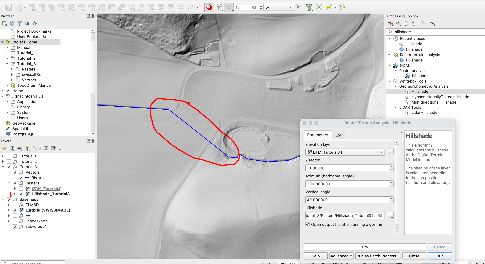
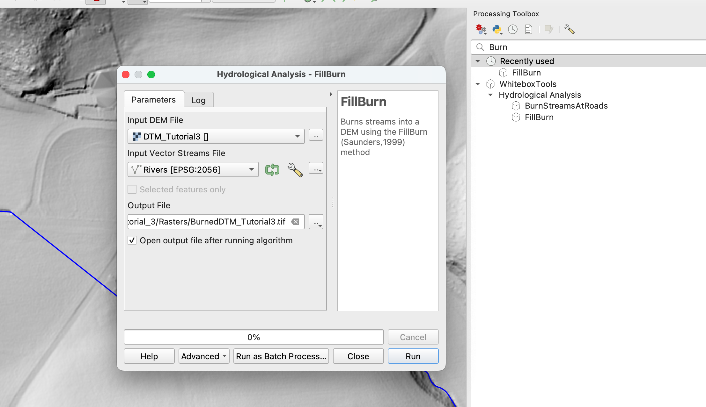
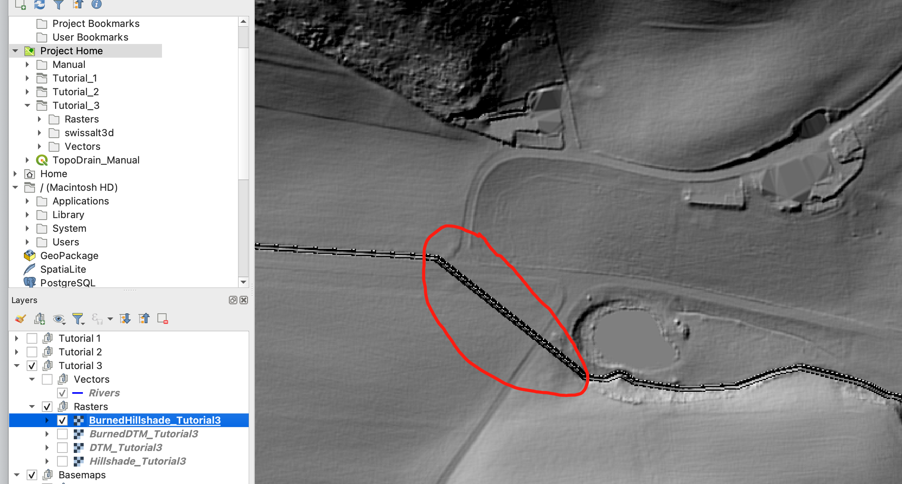
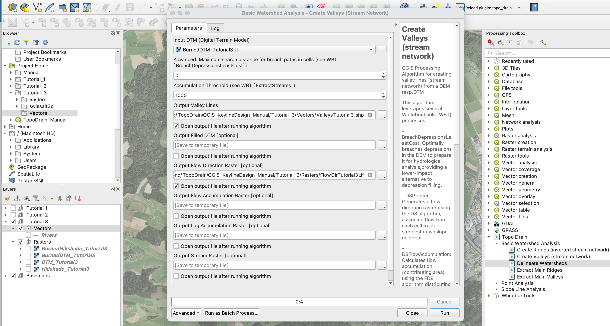

# Delineate Watersheds

This tutorial demonstrates how to delineate watersheds (drainage basins) using the TopoDrain plugin. 

> **Prerequisites**: Before starting this tutorial, you should have:
> - Completed the installation of QGIS, WhiteboxTools, and the TopoDrain plugin (see [Installation Guide in README.md](../README.md#installation-guide))
> - A preprocessed Digital Terrain Model (DTM) - see [DTM Preprocessing in Keyline-Design.md](Keyline-Design.md#dtm-preprocessing)

## Table of Contents
- [Overview](#overview)
- [Step 1: Analyze Your DTM](#step-1-analyze-your-dtm)
- [Step 2: Prepare Stream Network Data](#step-2-prepare-stream-network-data)
- [Step 3: Burn Streams into DTM](#step-3-burn-streams-into-dtm)
- [Step 4: Create Valley Network](#step-4-create-valley-network)
- [Step 5: Create Pour Points](#step-5-create-pour-points)
- [Step 6: Delineate Watersheds](#step-6-delineate-watersheds)

---

## Overview

**What is a Watershed?**

A watershed (also called drainage basin or catchment) is an area of land where all water that falls within it drains to a common outlet point. Understanding watershed boundaries is crucial for Water resource management. It helps identifying contributing areas to streams, ponds, or water bodies

---

## Step 1: Analyze Your DTM

Before delineating watersheds, it's important to analyze your Digital Terrain Model (DTM) to identify potential issues that could affect the results.

### Create a Hillshade

Use the WhiteboxTools **"Hillshade"** tool to create a visualization that reveals terrain features:

1. Open the **Processing Toolbox**
2. Search for **"Hillshade"** (WhiteboxTools)
3. Select your DTM as input
4. Run the tool

The hillshade helps identify terrain features and potential problems in the DTM.

### Identify Problem Areas

Examine the hillshade and DTM. Look for areas where:

- **Rivers pass under bridges**: The DTM may show the bridge elevation instead of the river bed
- **Culverted streams**: Underground water flow may not be represented in the DTM
- **Artificial features**: Human-made structures that interrupt natural water flow

> **Problem**: These features can create artificial barriers in the DTM that prevent proper watershed delineation. 

---

## Step 2: Prepare Stream Network Data

To address the issues identified above, you'll need an official stream network dataset for your area of interest.

### Download Official Stream Data

1. **Find authoritative stream data** for your region:
   - National or regional water management agencies
   - Government geospatial data portals
   - Environmental protection agencies

2. **Load the stream data** into QGIS:
   - Ensure it's a vector line layer
   - Verify it covers your study area
   - Check that the CRS matches your current map

---

## Step 3: Burn Streams into DTM

"Burning" streams into the DTM means lowering the elevation along stream paths to ensure they are properly represented as the lowest points in the landscape. This ensures that watershed delineation follows the actual stream network.

### Use WhiteboxTools FillBurn

1. Open the **Processing Toolbox**
2. Search for **"FillBurn"** (WhiteboxTools)
3. Configure the parameters:
   - **Input DEM**: Your original DTM
   - **Input Streams**: Your downloaded stream network layer
   - **Output DEM**: Save as a new file (e.g., `DTM_burned.tif`)
4. Run the tool

> **Alternative**: You can also use the **"BurnStreamsAtRoads"** tool if you have both a stream network and a road network. This tool specifically burns streams at road crossings to maintain hydrological connectivity.

### Verify the Burned DTM

Create a hillshade of the burned DTM to verify the results:

1. Use **"Hillshade"** tool again
2. Select the burned DTM as input
3. Compare with the original hillshade

> **What to look for**: The stream network should now appear as clear channels in the hillshade. Bridges and road crossings should no longer block the visual flow of streams.

---

## Step 4: Create Valley Network

Now create the valley (stream) network from the burned DTM using the TopoDrain **"Create Valleys"** tool.

### Run Create Valleys

For detailed information about this tool, see the [Create Valleys (Stream Network) section in Keyline-Design.md](Keyline-Design.md#create-valleys-stream-network).

**Quick steps:**

1. Open the **Processing Toolbox**
2. Search for **"Create Valleys"** (TopoDrain)
3. Configure parameters:
   - **Input DTM**: Select your **burned DTM** (NOT the original DTM)
   - **Accumulation Threshold**: Start with default (1000) or adjust based on desired detail
   - **Output Flow Direction Raster**: **Save this output** - it's required for watershed delineation
4. Run the tool

---

## Step 5: Create Pour Points

Pour points are the locations from which you want to delineate watersheds. These represent the outlets of the watersheds - the points where water exits the catchment.

### Create Pour Points Layer

1. In the **Browser panel** of QGIS, navigate to **Project Home** → your vectors folder (e.g., `Vectors`)
2. Right-click and select **New** → **ShapeFile**
3. Configure:
   - **File name**: `PourPoints`
   - **Geometry type**: **Point**
   - **CRS**: Match your DTM/project CRS
4. Click **OK**

### Add Pour Points

1. **Toggle editing mode** for the PourPoints layer
2. **Activate snapping** (Settings → Snapping Options):
   - Enable snapping for the Valley Lines layer
   - Set snapping mode to "Vertex and Segment"
   - Set appropriate tolerance (e.g., 10 map units)
3. **Add points** at locations where you want to delineate watersheds:
   - Click on valley lines where you want watershed outlets
   - **Important**: Points should snap exactly onto valley lines (created by tool "Create Valleys")
   - Add multiple points if you want to delineate several watersheds or subwatersheds
4. **Save edits**

> **Note**: If you don't use snapping, you'll also need to save the **Streams Raster** output from the "Create Valleys" tool and provide it as an additional input to the "Delineate Watersheds" tool.

---

## Step 6: Delineate Watersheds

Now use the TopoDrain **"Delineate Watersheds"** tool to create watershed polygons.

### Open the Tool

1. Open the **Processing Toolbox**
2. Search for **"Delineate Watersheds"** (TopoDrain)
3. Open the tool

### Parameters

**Required Parameters:**

- **Outlet Points**
  - Select your `PourPoints` layer
  - These are the watershed outlet locations
  - Each point will generate one watershed polygon

- **Flow Direction Raster**
  - Select the **Output Flow Direction Raster** from the "Create Valleys" tool
  - This raster defines how water flows from cell to cell across the terrain
  - Must be created from the burned DTM for accurate results

**Optional Parameters:**

- **Streams Raster (Optional)**
  - Select the **Output Stream Raster** from "Create Valleys" tool
  - Only required if you need to snap points to specific stream cells
  - Can be left empty if pour points are already snapped to valley lines

- **Maximum Snap Distance (Optional)**
  - Only used if "Streams Raster" is provided
  - Maximum distance (in cells) to search for high flow accumulation
  - Default: 0 (= no snapping)

**Output:**

- **Output Watersheds**
  - Specify save location (e.g., `Vectors/Watersheds.shp`)
  - The tool will create polygon features representing watershed boundaries

### Run the Tool

Click **Run** to execute the algorithm.

---
