# Keyline Design Manual

This manual guides you through implementing a Keyline Design using the TopoDrain plugin tools.

> **Prerequisites**: Before starting this tutorial, make sure you have completed the installation of QGIS, WhiteboxTools, and the TopoDrain plugin. See the [Installation Guide in README.md](../README.md#installation-guide) for detailed setup instructions.

## Table of Contents
- [DTM Preprocessing](#dtm-preprocessing)
- [Terrain Visualization: Contours and Hillshade](#terrain-visualization-contours-and-hillshade)
- [Creating Valleys and Ridges](#creating-valleys-and-ridges)
- [Create Perimeter](#create-perimeter)
- [Extract Main Valleys and Ridges](#extract-main-valleys-and-ridges)
- [Create Start Points for Keylines](#create-start-points-for-keylines)
- [Create Keylines](#create-keylines)
- [Create Equidistant (Parallel) Lines Between Keylines](#create-equidistant-parallel-lines-between-keylines)
- [Keyline Design: Final Considerations](#keyline-design-final-considerations)

## DTM Preprocessing

Before using the TopoDrain tools, it's important to prepare your Digital Terrain Model (DTM) properly.

### Obtaining High-Resolution DTM Data

Get a high-resolution Digital Terrain Model (DTM) raster dataset for your study area.

**For users in Switzerland:**
- May you want to use the QGIS plugin **"Swiss Geo Downloader"** to download the **swissALTI3D** dataset
- ⚠️ **Important:** Make sure to choose the best resolution (0.5 m) before downloading

### Merging Multiple DTM Files

If you have downloaded multiple DTM tiles, you need to merge them into a single file:

1. Use the GDAL processing tool **"Merge"** to combine all tiles into one DTM file (.tif)

> **Tip:** If your DTM has a large extent, you may want to clip it to your study area to make subsequent processing faster. Use the GDAL processing tool **"Clip raster by extent"** or **"Clip raster by mask layer"**.

### Optional: Burning Streams at Roads (for Watershed Delineation)

If you plan to delineate water basins later (e.g., using the TopoDrain tool **"Delineate Watershed"**), you may want to apply preprocessing to ensure meaningful delineation at road crossings. 

**Use the WhiteboxTools processing tool "BurnStreamsAtRoads":**

More information: **[Delineate Watersheds Manual](./Delineate-Watersheds.md)**

---

## Terrain Visualization: Contours and Hillshade

While not required for the processing steps, creating contour lines and a hillshade visualization helps you better understand the terrain characteristics. The hillshade in particular may reveal terrain features, which are interesting to consider for planning keylines.

### Creating Contour Lines

1. Use the WhiteboxTools processing tool **"ContoursFromRaster"**
2. Choose an appropriate contour interval (e.g., 1 m)
3. Run the tool on your DTM

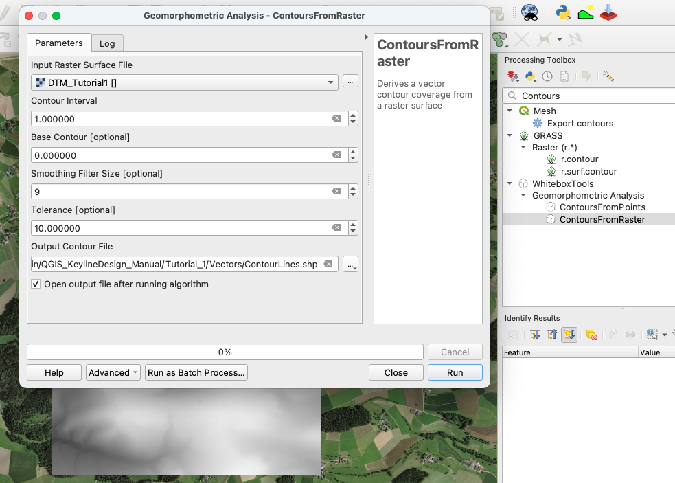

### Creating Hillshade

1. Use the WhiteboxTools processing tool **"Hillshade"**
2. Run the tool on your DTM
3. Adjust the symbology of the contour lines layer to display thin grey lines for better visualization

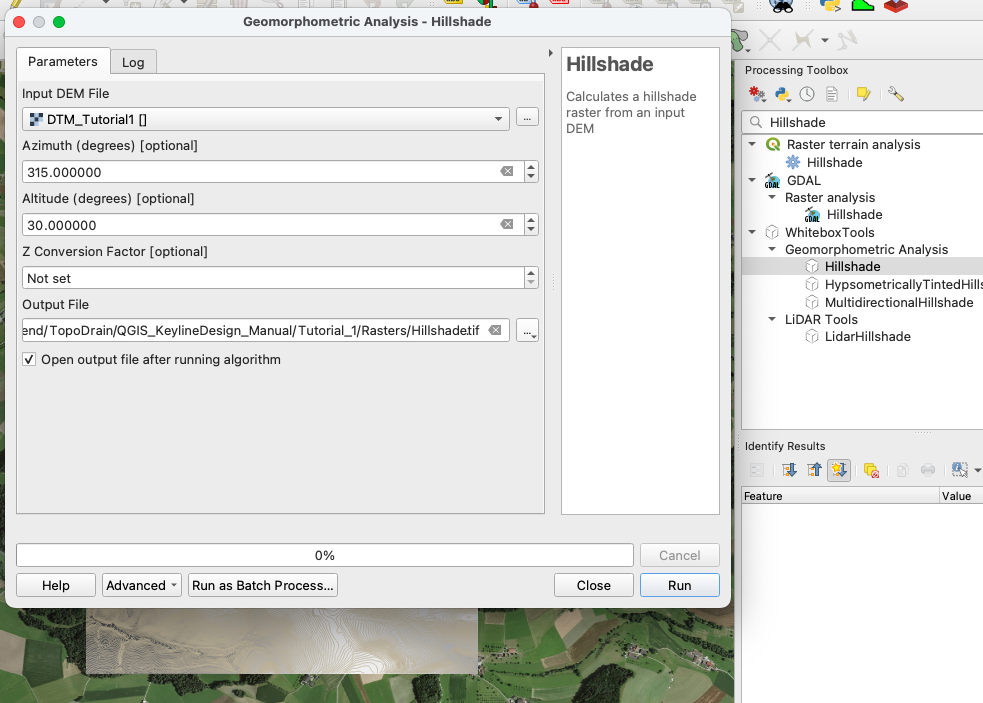

---

## Creating Valleys and Ridges

### Create Valleys (Stream Network)

The **Create Valleys (stream network)** tool is the starting point for analyzing drainage patterns in your terrain. This tool processes a Digital Terrain Model (DTM) to generate valley lines representing the natural drainage network.

The tool uses a series of WhiteboxTools processes:
1. **D8Pointer** - Calculates flow direction for each cell
2. **D8FlowAccumulation** - Determines accumulated flow (drainage area) for each cell  
3. **ExtractStreams** - Identifies stream network based on flow accumulation threshold
4. **RasterStreamsToVector** - Converts raster streams to vector polylines
5. **StreamLinkIdentifier** - Assigns unique IDs to individual stream segments
6. **VectorStreamNetworkAnalysis** - Analyzes network topology and calculates stream properties

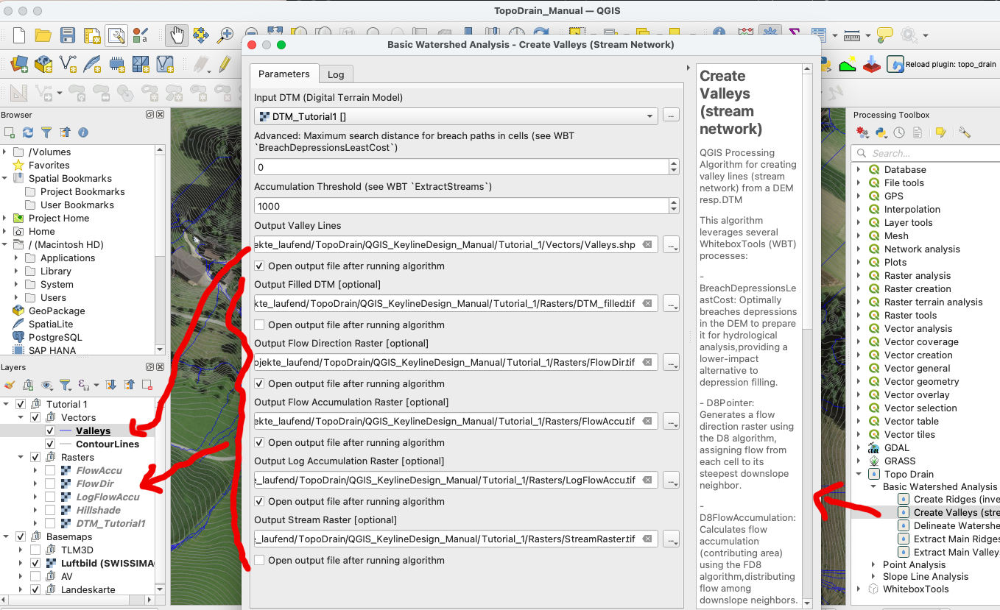

#### Parameters

- **Input DTM (Digital Terrain Model)**: Select your preprocessed Digital Terrain Model

- **Advanced: Maximum search distance for breach paths in cells**: Maximum distance to search when breaching depressions
  - Default: 0
  - Usually the default value works well
  - See WhiteboxTools `BreachDepressionsLeastCost` for details

- **Accumulation Threshold**: Controls stream network density
  - Lower values = denser network with more small tributaries
  - Higher values = simplified network with only major valleys
  - Default: 1000 cells
  - See WhiteboxTools `ExtractStreams` for details
  - **Tip**: Prefer smaller values to capture more detail, as you can extract the main valley lines in a later step

#### Outputs

The tool generates several layers:

1. **Output Valley Lines (polylines)** - The primary output showing valley lines
   - **Main result** layer for further analysis
   - Contains attributes: `LINK_ID`, `TRIB_ID`, and `DS_LINK_ID` (used in subsequent tools)
   - Recommend styling with thin blue lines for visualization
   
2. **Output Filled DTM (raster)** - Depression-breached terrain model
   - Not needed in further Keyline-Design process
   
3. **Output Flow Direction Raster** - D8 flow direction grid
   - Only needed in further processing if you optionally you want to delinate watershed with "Delinate Watersheds" later
   
4. **Output Flow Accumulation Raster** - Shows accumulated flow for each cell
   - **Needed** in further Keyline-Design process (Extract Main Valleys)
   - Higher values indicate larger drainage areas
   
5. **Output Log Accumulation Raster** - Logarithmic scale of flow accumulation
   - Better for visualization than raw accumulation values
   - Makes small and large values easier to distinguish

6. **Output Stream Raster** - Rasterized stream network
   - Intermediate output before vectorization
   - Not needed in further Keyline-Design process

---

### Create Ridges (Inverted Stream Network)

The **Create Ridges (inverted stream network)** tool works similarly to the Create Valleys tool, but analyzes ridge lines instead of valley lines. Simply provide your normal DTM as input - the tool automatically inverts the elevation values internally before processing.

It uses the same WhiteboxTools processes (D8Pointer, D8FlowAccumulation, ExtractStreams, etc.) on the inverted terrain model, where ridges become valleys in the inverted space.

The parameters and outputs are identical to the Create Valleys tool, so refer to that section for detailed explanations.

**Styling recommendation:** Display ridge lines in orange/brown to distinguish them from valley lines.

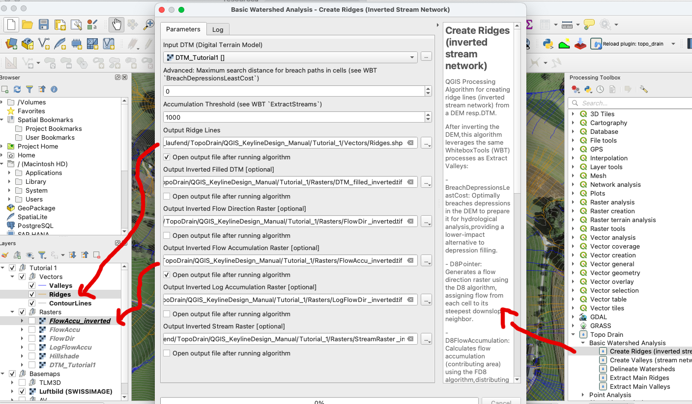

---

## Create Perimeter

Before extracting main valleys and ridges, you need to define the boundary (perimeter) of your study area. This perimeter will be used to clip and focus the analysis on your area of interest.

### Creating a Perimeter Polygon

1. In the **Browser panel**, navigate to **Project Home** → folder where you want to create file e.g. **Vectors**
2. Right-click and select **New** → **ShapeFile**
3. Configure the new shapefile:
   - **File name**: Choose a descriptive name (e.g., `Perimeter`)
   - **Geometry type**: Select **Polygon**
   - **Coordinate Sysetme (CRS)**: Set to match your map/DTM CRS
   - **Optional**: Add a text field named "NAME" to store the study area name
4. Click **OK** to create the shapefile
5. Add the new layer to your map if not automatically added
6. Toggle editing mode (click the pencil icon) and use the **Add Polygon Feature** tool to digitize your perimeter polygon around your study area (e.g., around the agricultural field on the hillslope)
7. Save edits when finished

**Tip**: Consider valley and ridge lines when drawing your polygon. You may want to include important tributaries (valleys or ridges branches) that extend beyond the exact boundary of the agricultural field, as these features can be relevant for the overall Keyline Design. Conversely, you may want to exclude main tributaries that intersect the perimeter edge but are not relevant for your study area analysis. You may need to switch back and forth between perimeter editing and the “Extract Main Valleys” and “Extract Main Ridges” tools to refine the transition between valley, ridge, and perimeter lines — the perimeter boundaries act as the “final” ridge or valley.

**Styling recommendation**: Set the polygon to have a black outline (no fill).

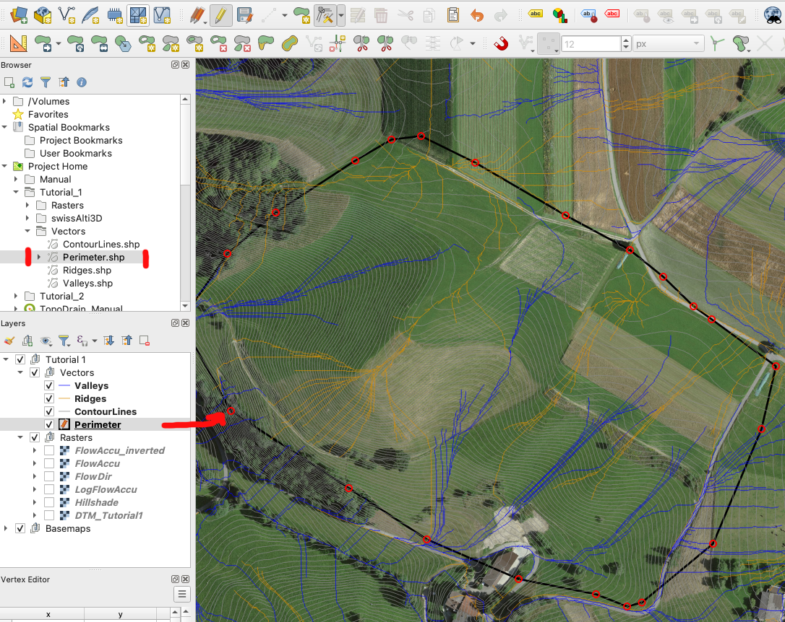

> **Note**: If you run a tool multiple times and overwrite an existing layer, you may need to refresh the layer visibility in QGIS. Right-click on the layer → **Change Data Source** → select the data file again to refresh the layer.

---

## Extract Main Valleys and Ridges

After creating the complete valley and ridge networks, you need to identify and extract the main (most significant) valleys and ridges for your study area.

### Extract Main Valleys

The **Extract Main Valleys** tool identifies the most significant valley lines (flow paths) from the complete valley network by selecting the tributaries with the highest flow accumulation values within your perimeter. The tool extracts tributaries (flow paths) with the highest flow accumulation and ranks them by their maximum flow accumulation value within the perimeter area. 

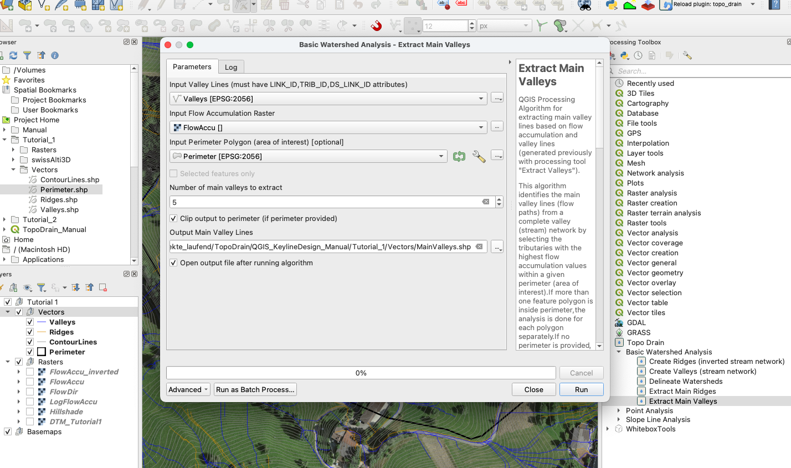

> **Performance Note**: The **Extract Main Valleys** and **Extract Main Ridges** tools can take considerable time with large areas or dense valley/ridge networks. **Always provide a perimeter** to improve performance. The progress bar may stall around 20% for an extended period during spatial join operations - this is normal for large areas. You can create an issue on the GitHub "Issues" page if it's relevant to you.

#### Parameters

- **Input Valley Lines**: Select the **Output Valley Lines** from the "Create Valleys" tool
  -* *Note**: Must have `LINK_ID`, `TRIB_ID`, and `DS_LINK_ID` attributes (automatically created by Create Valleys)

- **Input Flow Accumulation Raster**: Select the **Output Flow Accumulation Raster** from the "Create Valleys" tool
  - **Note**: Use the same flow accumulation raster that was used to create the valley lines

- **Input Perimeter Polygon**: Select your perimeter polygon layer
  - Optional: If not provided, uses the full extent of valley lines

- **Number of main valleys to extract**: Specify how many main valleys to extract
  - Default: 2
  - **Tip**: Try to guess the number of main tributaries (branches) from the Valleys layer. It's better to choose a higher value - you can always delete unnecessary main valley lines later in edit mode
  - **Example**: If you see approximately 4 main valleys, choose 5 for this parameter to ensure you capture all important features

- **Clip output to perimeter**: Whether to clip the output lines to the perimeter boundary
  - Default: True
  - Keep enabled to focus on your study area

#### Output

**Output Main Valleys**: Line layer containing the main valley lines with attributes:
- `LINK_ID` - Standard cross-platform identifier for each line segment
- `TRIB_ID` - Tributary identifier
- `RANK` - Valley order (1 = first main valley with highest flow accumulation, 2 = second highest, etc.)
- `POLYGON_ID` - Identifier if multiple perimeter polygons were used
- `DS_LINK_ID` - Downstream link identifier

#### Styling Recommendation

Style the Main Valleys layer with a **blue line that is thicker** than the Valleys layer, and add a marker line showing flow direction:

1. **Line style**: Thick blue line
2. **Add marker line** (for flow direction):
   - **Symbol layer type**: Marker line
   - **Interval**: e.g., 10 m
   - **Marker**: Triangle (blue)
   - **Size**: 2
   - **Rotation**: **90°** (to align with flow direction)

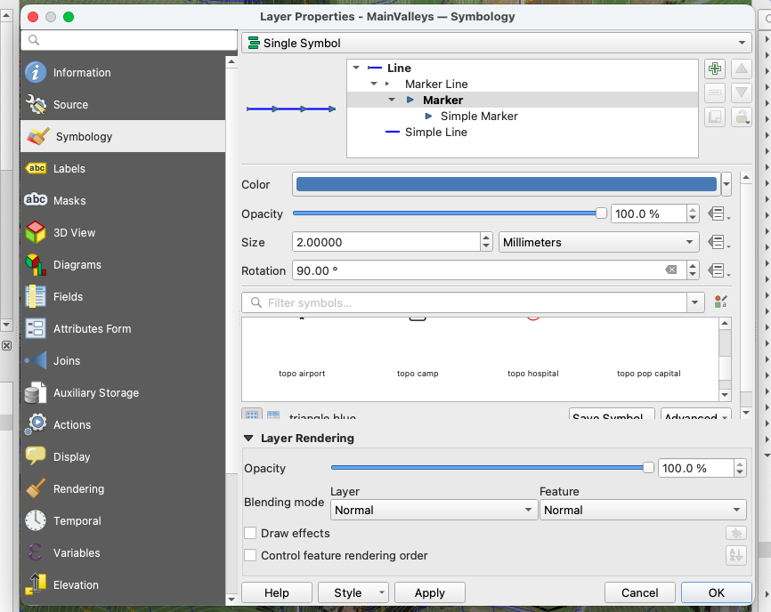

#### Label Recommendation

Add labels showing the **RANK** attribute to identify the valley order:

1. Enable labels for the Main Valleys layer
2. **Label with**: `RANK`
3. This displays: 1 = first main valley (highest flow accumulation), 2 = second highest, etc.

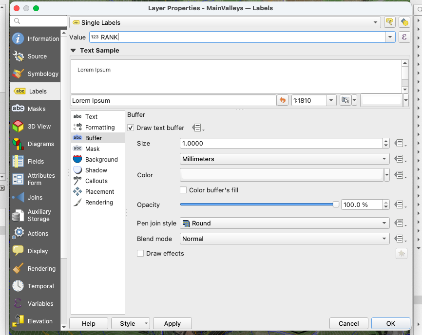

> **Note**: If you run a tool multiple times and overwrite an existing layer, you may need to refresh the layer visibility in QGIS. Right-click on the layer → **Change Data Source** → select the data file again to refresh the layer.

---

### Extract Main Ridges

The **Extract Main Ridges** tool works identically to Extract Main Valleys, but operates on ridge lines instead of valley lines.

Use the same approach:
- **Input Ridge Lines**: Select the **Output Ridge Lines** from the "Create Ridges" tool
- **Input Flow Accumulation Raster**: Select the **Output Inverted Flow Accumulation Raster** from the "Create Ridges" tool (inverted flow accumulation)
- Configure the same parameters as described in the Extract Main Valleys section

**Styling recommendation**: Use orange/brown thick lines to distinguish from main valleys.

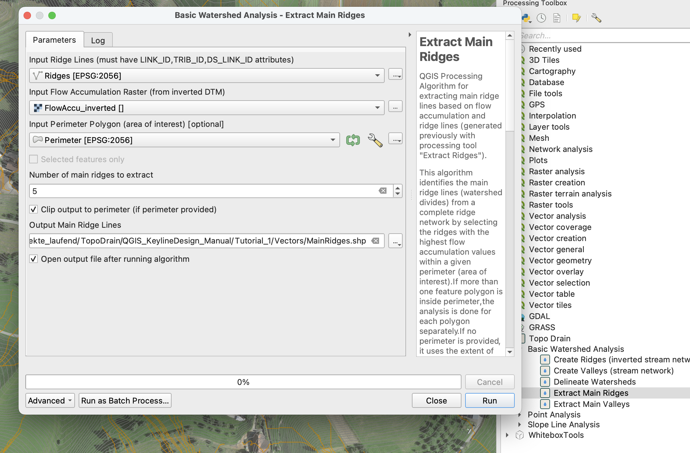

---

### Adjust Main Valleys and Main Ridges

**Goal**: Create a clean valley-ridge pattern suitable for keyline design. Topography is often complex, resulting in intricate main valley and main ridge patterns. Some creativity is needed here to create a useful pattern that works for your design.

> **Note**: Depending on your terrain, you may even want to create Main Valleys and Main Ridges from scratch by manual digitizing rather than extracting them. However, this example shows how to adjust extracted main valleys and main ridges. In the following illustration, the areas to be adjusted are marked with a red sketch line:

#### Step 1: Smooth the Lines

⚠️ Before editing the Main Ridges and Main Valleys in QGIS, it's recommended to use the WhiteboxTools processing tool **"SmoothVectors"**:

- This reduces the number of vertices, making editing easier
- It also improves useability for subsequent tools like "Get Points Along Line" (distance calculations are more appropriate on smoothed lines than on very wavy lines)

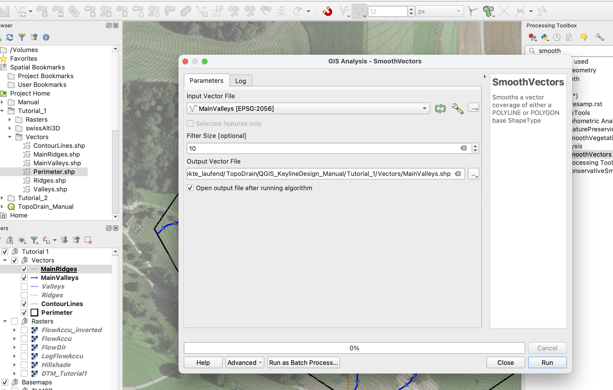

#### Step 2: Edit the Pattern

Edit the Main Valleys and Main Ridges layers to create a clean pattern:

1. Toggle editing mode for the Main Valleys layer
2. Use editing tools to adjust line geometry
3. Delete unnecessary segments or features
4. Repeat for Main Ridges layer

**Pattern recommendation**: While the "Create Keylines" tool can handle valley-to-valley or ridge-to-ridge tracing, it's recommended to create a pattern with **alternating** features:

**Perimeter → Valley → Ridge → Valley → ... → Perimeter**

Edit example: Step 1. Use “Split Features” to split at the point where you want to delete a part:

Edit example: Step 2. Delete the feature you want to remove:

Edit example: Step 3. Use the “Vertex Tool” to complete the main valley line "manually":

#### Final Pattern

After editing, you should have a clean, alternating valley-ridge pattern ready for keyline creation:

> **Note on Complex Topography**: As already mentioned, creating the main valley/ridge pattern often requires creativity, especially with complex topography. For instance, if you have a hill without clearly distinguishable valleys and ridges (so a lot of more or less parallel flow paths), you may want to manually create a valley or ridge line through the middle of the hill (instead using tool "Extract Main Valleys") and a ridge resp. valley line at the boundaries. When creating lines manually, make sure to add a field named `LINK_ID` and assign a unique value to each line.

---

## Create Start Points for Keylines

Now that you have prepared the main valleys and ridges, you need to identify starting points for your keylines. These points will determine where each keyline begins along the valley or ridge lines.

> **Important Note**: Various approaches are possible for selecting start points. For example, you may want to:
> - Start with existing features visible in the elevation model (see hillshade, field survey)
> - Pay attention to regular intervals between management patterns
> - Start at or near a keypoint (inflection point in the terrain profile)
> - Consider other characteristics such as soil properties or field observations (water flow paths, water accumulation areas, etc.)
> - Start points should be located **exactly on** a main valley line, main ridge line, or perimeter boundary. This ensures keylines can trace in both directions. When adding start points manually in QGIS, **activate snapping** (Settings → Snapping Options) to ensure points snap precisely to the line features.
> The best approach depends on your specific design goals and site conditions.
>

### Example: Using Keypoints from Main Valley Lines

In this example, we'll first extract keypoints along main valley lines using the **Get Keypoints** tool. This tool analyzes the elevation profile along each valley line to identify inflection points.

#### How the Tool Works

The **Get Keypoints** algorithm identifies keypoints (points of transition from concave to convex curvature) along valley lines by analyzing elevation profiles extracted from the DTM:

- Extract Elevation Profiles along the lines
- Fits a polynomial function to the elevation data
- Calculate Curvature
- Identify Inflection Points. These points represent transitions from concave to convex
- Also identifies local extrema in curvature (strongest curvature points)
- Selects keypoints based on:
  - How strong the curvature change is
  - Whether they meet the minimum distance constraint
  - The minimum number of keypoints requested
- Ranks candidate points by curvature strength

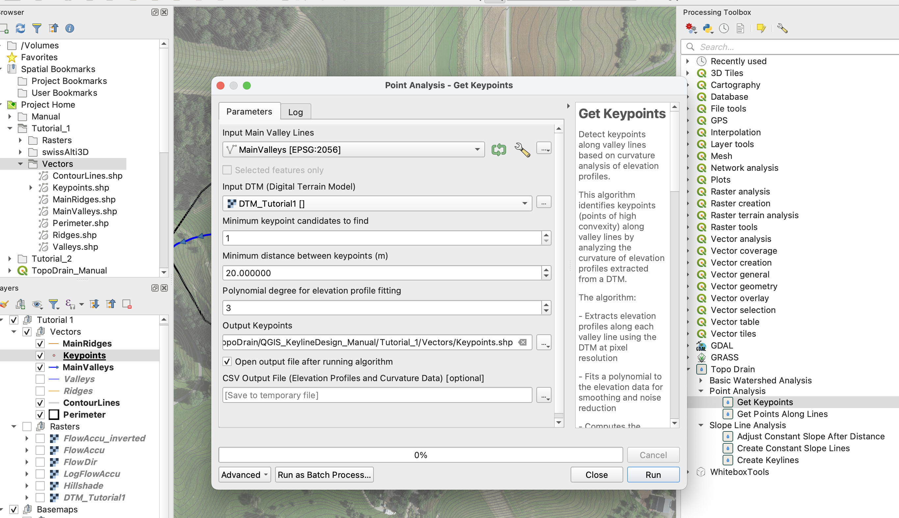

#### Parameters

- **Input Main Valley Lines**: Select your processed Main Valleys layer
  - Must have `LINK_ID` attribute (automatically present from Extract Main Valleys)

- **Input DTM (Digital Terrain Model)**: Select your DTM raster layer

- **Minimum keypoint candidates to find**: Controls detection sensitivity
  - Default: 1
  - The algorithm will find at least this many keypoint candidates per line
  - If fewer inflection points exist, it selects the most likely locations based on curvature

- **Minimum distance between keypoints (m)**: Ensures spatial separation between keypoints
  - Default: 20.0 meters
  - Prevents that selected keypoints are very close to each other

- **Polynomial degree for elevation profile fitting**: Controls smoothing level
  - Purpose: Controls the smoothing level of the elevation profile.
  - Default: 3 (cubic polynomial)
  - Higher degree: Use when the terrain profile shows more frequent or complex curvature changes.

- **CSV Output File** (optional): Exports elevation profiles and curvature data

#### Output

**Output Keypoints**: Point layer with attributes:
- `VALLEY_ID` - Reference to the valley line
- `RANK` - Ranking based on curvature strength
- `CURVATURE` - Curvature value at the point

#### Verification with Elevation Profile

After extracting keypoints, it's good practice to verify their locations using the QGIS plugin **"Terrain Profile"** (or similar profile tool):

1. Install the **Terrain Profile** plugin if not already installed
2. Open the profile tool and select your DTM layer
3. Use Selection method "Selected polyline"
4. Select the main valley line to show it's elevation profile

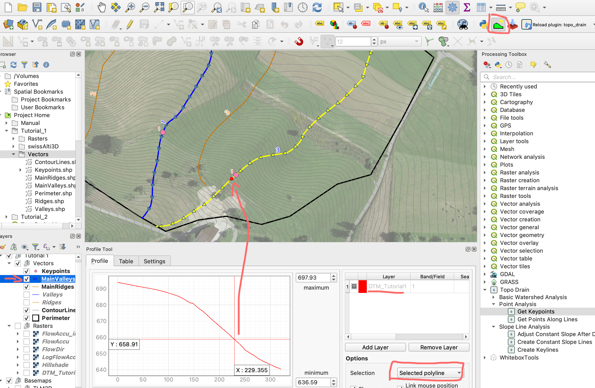

**Tip**: If keypoints are not located where expected, try adjusting the polynomial degree parameter considering the shape of the terrain profile.

---

### Create Regularly Spaced Points Along Valley Lines

Instead of using keypoints directly, you may want to create regularly spaced points along your valley lines to ensure consistent distances between keylines or management patterns.

#### Using Get Points Along Lines

The **Get Points Along Lines** tool distributes points along input lines at regular distance intervals.

**How it works:**
- Places points evenly along lines at specified distance intervals
- Can optionally use reference points (e.g., keypoints) to create regular distances with respect to these point locations
- When reference points are provided, starts from the reference point and expands bidirectionally
- If more than one reference point is on a line tries to place points optimally but will may not end up in complet regular distances, since the position of the reference points is not modified.

#### Parameters

- **Input Lines**: Select your Main Valleys layer
  - **Note**: You may want to select only one main valley line from which you want to start creating keylines
- **Reference Points** (optional): Select keypoints layer if you want to start a keyline from exactly a keypoint
  - **Note**: You may want to select only one reference point (keypoint) per line to ensure completely regular distances
- **Distance between points**: Specify the regular spacing (e.g., 20 m)

#### Output

**Output Points**: Point layer with regularly distributed points containing:
- All original line attributes
- `POINT_ID` - Sequential index of the point along the line
- `DISTANCE` - Distance from line start to the point
- `IS_REF_PNT` - Boolean flag indicating if this is a reference point (e.g. keypoint)

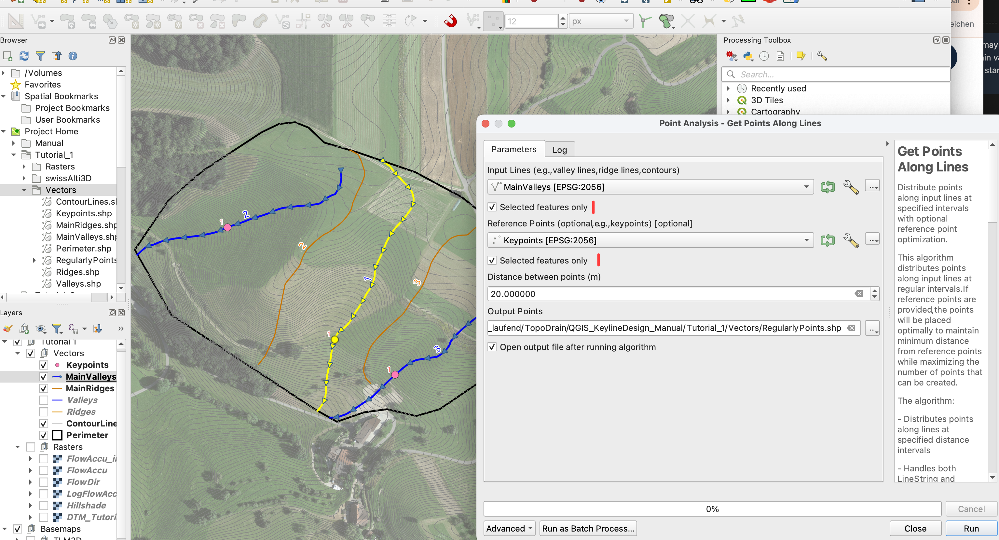

---

## Create Keylines

The next step is to create the actual keylines - constant slope lines (off contour) that follow the natural topography and manage water flow across your landscape.

### Using the Create Keylines Tool

The **Create Keylines** tool traces constant slope lines from start points, iteratively moving between valleys and ridges to create a comprehensive keyline network.

#### How it Works

The algorithm creates keylines by iteratively tracing:
1. **First trace**: From start points (on valleys) to ridges, using the start valley as barrier
2. **Creates new start points** beyond ridge endpoints
3. **Second trace**: From new points (on ridges) to valleys, using ridges as barriers
4. **Continues iteratively** while endpoints reach target features (ridges or valleys)
5. **All keylines are oriented** from valley to ridge direction

**Technical Implementation:**
The algorithm creates a cost raster based on (Euclidean) distance and the expected slope (Desired Slope) at a distance for constant slope line tracing. It uses WhiteboxTools processes like **CostDistance** and **CostPathway** to determine the optimal path. If the length of the traced line exceeds the Euclidean distance such that the expected slope exceeds the **Slope Deviation Threshold** condition, a new iteration is started from the point where this condition was violated.

#### Parameters

- **Input DTM (Digital Terrain Model)**: Select your DTM raster layer

- **Start Points**: Select your regularly spaced points layer
  - Select only the specific points where you want keylines to start from
  - **Recommended**: Start from points on main valley lines
  - **Note**: You can also start from ridge lines or from the perimeter (which automatically acts as ridge or valley), but always define slope parameters from the valley to ridge perspective regardless of start point
  - **Tip**: If createing Start Points manually use snapping option in edit mode
  - **Tip**: Start with only 1-2 selected points first, even if you want to create more, to ensure it works as expected. Then select all desired points in a second run. Performance of the tool is not very good with many start points!

- **Main Valley Lines**: Select your processed Main Valleys layer

- **Main Ridge Lines**: Select your processed Main Ridges layer

- **Perimeter (Area of Interest)**: Select your perimeter polygon
  - Always acts as the final destination boundary (automatically acts as valley or ridge line)

- **Desired Slope**: Target slope as decimal (always from valley to ridge perspective)
  - Example: `0.01` = 1% downhill from valley toward ridge (direct flow for water movement)
  - Example: `-0.01` = 1% uphill from valley toward ridge (not recommended)
  - **Note**: The algorithm tends to create slightly smaller slopes than defined because of euclidean distance approach. e.g. if you prefer at least 1% slope, you may want to define `0.011` (1.1%) instead of 0.01

- **Change Slope At Distance**: Optional - creates two-segment keylines
  - Value between 0.01 and 0.99 representing the fraction of line length where slope changes
  - Example: `0.6` = use Desired Slope for first 60% of line, then New Slope for remaining 40%
  - Always calculated from valley to ridge perspective
  - Leave empty for single-slope keylines

- **New Slope After Change Point**: Required if Change Slope At Distance is set
  - Slope for the second segment (always valley to ridge perspective)
  - Example: `0.0` = level contour (0%) for infiltration after initial direct flow

- **Advanced: Slope Deviation Threshold**: Maximum allowed slope deviation (default: 0.2 = 20%)
  - Triggers slope refinement (new iteration) if exceeded

- **Advanced: Max Iterations Slope**: Maximum iterations for slope refinement (default: 30)
  - Limits the number of iterations for slope refinement. 

#### Example Configuration

In the example shown:
- **Start points**: Two start points selected - one at the keypoint, one about 160 m above it (8 × 20 m spacing)
- **Desired Slope**: `0.01` (1% downhill) for direct water flow from valley toward ridge
- **Change Slope At Distance**: `0.6` (change after 60% of line length)
- **New Slope After Change Point**: `0.0` (level contour, 0%) for slow flow and infiltration

This creates keylines that initially move water (1% slope), then transition to level contours (0% slope) to promote infiltration in the latter portion.

#### Output

**Output Keylines**: Line layer containing all traced keylines with attributes describing the slope characteristics.
- `SLOPE` - Value of input parameter "Desired Slope"
- `CHANGE_AFTER` - Value of input parameter "Change Slope At Distance"
- `SLOPE_AFTER` - Value of input parameter "New Slope After Change Point"

> **Note**: All keylines are always oriented from valley to ridge direction, so you can easily visualize the flow direction using marker arrows.

#### Styling Recommendation

Style the Keylines layer with a **red thick line** and add a marker line showing flow direction:

1. **Line style**: Thick red line
2. **Add marker line** (for flow direction):
   - **Symbol layer type**: Marker line
   - **With Interval**: e.g., 10 m
   - **Marker**: Triangle (red)
   - **Size**: 2
   - **Rotation**: **90°** (to align with flow direction)

#### Verification with Elevation Profile

After creating keylines, verify their slope characteristics using the QGIS plugin **"Terrain Profile"**:

1. Open the Terrain Profile tool and select your DTM layer
2. Use Selection method "Selected polyline"
3. Select a keyline to display its elevation profile
4. Check that the slope matches your expected configuration (e.g., 1% initial slope, then 0% after the change point)

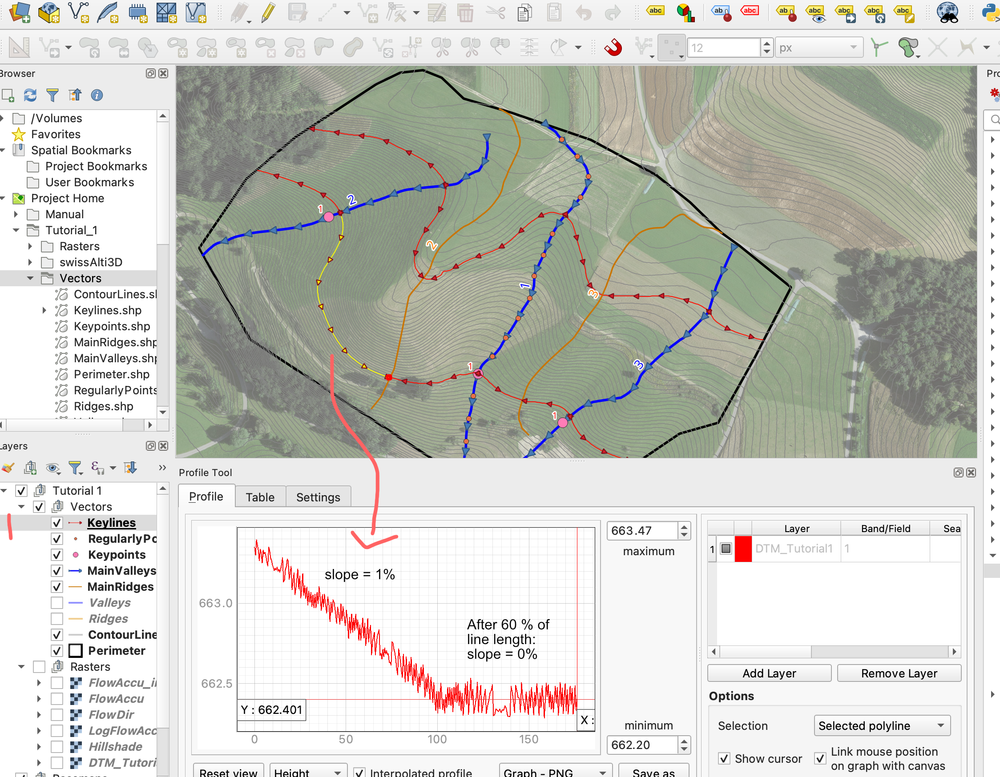

**Performance Note**: The algorithm can be slow with many start points or for a large and complex site. Always test with a few points first before creating the full keyline network.

**Alternative Start Points**: As already mentioned, it is also possible to set start points on main ridge lines or the perimeter boundary. Here is an example:

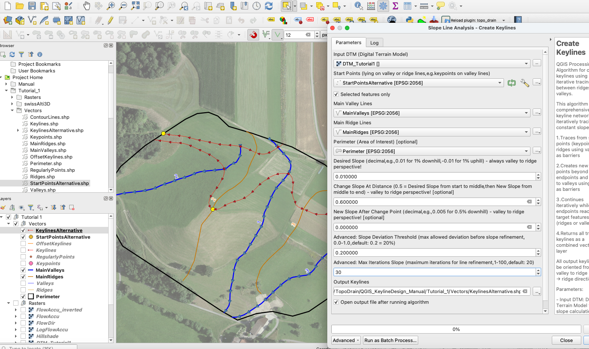

---

## Create Equidistant (Parallel) Lines Between Keylines

After creating your "main" keylines, you may want to add parallel lines between them to create additional features such as:
- Agroforestry lines
- Traffic patterns for tractor routes
- Management zones where slope of the line is less critical than for the main keylines, and where the pattern of parallel lines is more important

> **Note**: Automatically creating perfect parallel lines is not straightforward in QGIS, so this process requires some manual editing work. The following approach provides a practical workflow - there will be several other ways to do it.

> **Important**: Completely equidistant (parallel) lines are only possible if you start from one single main keyline. If you want parallel lines starting from multiple keylines, they won't be perfectly equidistant to each other since each main keyline follows a different path. Choose your approach based on your specific purpose and requirements.

### Approach Using "Offset Lines" Tool

The QGIS processing tool **"Offset lines"** creates parallel single-sided buffer lines (offset to the left of the line direction). You'll need to apply this tool iteratively to build up a complete pattern of parallel lines.

#### Step-by-Step Workflow

1. **Select a keyline** from your Keylines layer that you want to create parallel lines from

2. **First offset - positive direction**:
   - Use the QGIS processing tool **"Offset lines"**
   - Set **Distance**: `20` (meters, or your desired spacing)
   - This creates a line parallel to the left of the line direction
   - The result is a new layer with the offset line

3. **Second offset - negative direction**:
   - Select the same keylines again
   - Use **"Offset lines"** tool again
   - Set **Distance**: `-20` (negative distance)
   - This creates a line parallel to the right of the line direction

4. **Edit the created offset lines manually**:
   - Toggle editing mode for the offset lines layer(s)
   - Use QGIS editing tools (e.g., **Vertex Tool**) to adjust line geometry as needed
   - Fix any issues at the end of the lines where they don't follow terrain appropriately respectively are not parallel to keylines
   - **Important**: Where offset lines end up at distances below the desired distance (e.g., lines converge too closely), remove those line parts to maintain minimum spacing
   - Merge offset layers if desired using processing tool **"Merge Vector layers"** (or do it later for all offset layers at once) 

5. **Create additional parallel lines**:
   - Select the offset lines from which you want to proceed with adding parallel lines
   - Use **"Offset lines"** tool again with appropriate distance
   - Remember: offset is always created to the **left** of the line direction, so select lines accordingly

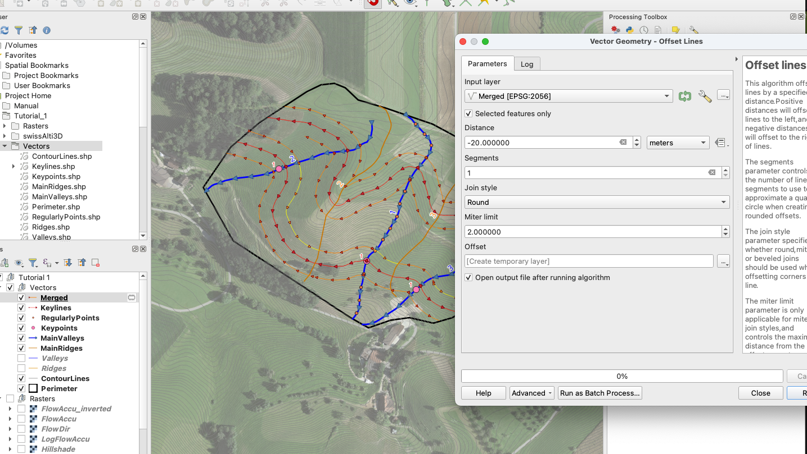

6. **Continue the iterative process**:
   - Proceed with creating more offset lines, always respecting the line direction
   - Edit lines as needed to maintain proper spacing
   - Remove line segments where spacing becomes too narrow

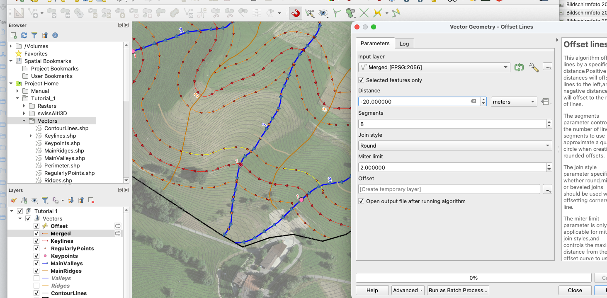

7. **Merge all offset lines into a single layer**:
   - Once you have created all parallel lines, you'll have multiple offset line layers
   - Option A (recommended): Use processing tool **"Merge Vector layers"** to merge all offset layers to a new layer e.g. "OffsetKeylines"
   - Option B: Selet all features and paste them directly into your existing Keylines layer

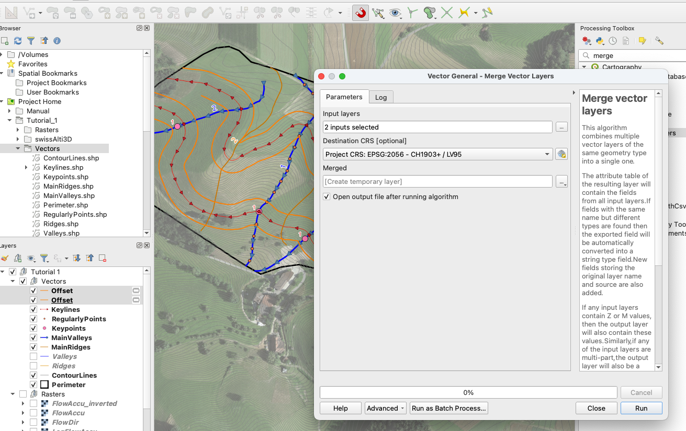

#### Result

You'll have a network of main keylines (with desired slope) supplemented by parallel lines (offset lines) that provide regular spacing for agroforestry, traffic patterns, or other management purposes.

#### Final Keyline Design

After completing all steps, you will have achieved a comprehensive first keyline design pattern:

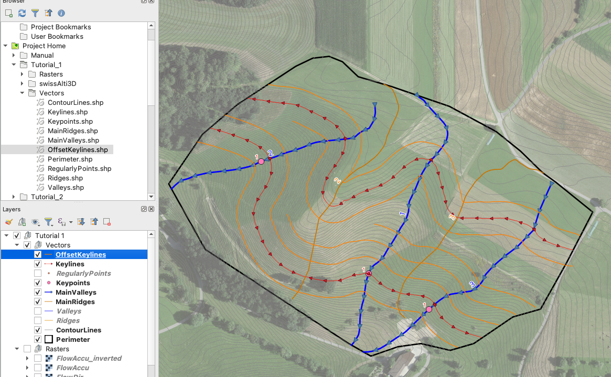

---

## Keyline Design: Final Considerations

This tutorial has focused on demonstrating **how to use the TopoDrain tools** for technical analysis and keyline generation. However, creating an effective keyline design in reality is a **complex task** that goes far beyond the technical workflow.

### Important: Tools Are Just the Beginning

The tools presented here provide a foundation for analysis and planning, but **real-world implementation requires careful consideration** of many factors that cannot be fully captured by digital terrain models and automated algorithms.

### Critical Questions for Implementation

Before implementing your keyline design, work closely with **farmers and experienced practitioners** to address critical questions:

#### 1. Hydraulic Capacity and Safety

- **Is the soil stable enough for keyline implementation?**
  - **Especially critical on steep hillsides**: Is there a risk of landslides or mass soil movement?
  - Could water accumulation along keylines trigger slope instability?
  - Have a look at risk maps
  - Consider geotechnical assessment for steep slopes or areas with known instability
  - May need additional slope stabilization measures (vegetation, retaining structures) before implementing keylines

- **What happens during extreme rainfall events?**
  - What if a heavy rainfall event exceeds the keylines' designed capacity?
  - Consider integrating **overflow management** such as "spillway" (drain release) pipes at defined locations
  - Plan for emergency spillways or bypass channels to prevent erosion damage

#### 2. Soil Properties and Erosion Risk

- **What are the soil characteristics of your site?**
  - How susceptible is the soil to erosion?
  - What is the soil's infiltration capacity?
  - Do you need to **compact or stabilize the soil along keylines** to prevent channel formation?
  - Consider soil texture, organic matter content, and structural stability
  - **Add spillways to prevent keyline overflow** - overflow is the main cause of erosion along keylines
  - Design controlled overflow points respectively spillway pipes where excess water can safely exit without damaging the keyline

#### 3. Physical Shaping and Cultivation

- **How will you shape the keylines in the field?**
  - Design keylines to be as **unobtrusive as possible** for cultivation and farm operations
  - Consider equipment requirements (tractors, implements, turning radius)
  - Ensure gradual transitions and avoid sharp changes in slope

#### 4. Model Validation

- **Does reality match the model?**
  - Surface runoff behavior may differ from predictions based solely on topography
  - Vegetation, soil crusting, compaction, and microtopography all influence actual water flow
  - **Check for existing drainage infrastructure** - there may be underground drainage pipes, tiles, or other water management systems that affect water flow and must be considered in the design
  - **Field observations during rainfall events are invaluable**
  - Be prepared to adjust the design based on real-world performance 

- **Do you want to combine keylines with water retention measures?**
  - Consider integrating **retention pools and ponds** for infiltration or irrigation water storage
  - This may significantly influence the keyline design pattern and how you want to direct water flow
  - Plan keyline layout to direct water toward specific collection points
  - Consider overflow management from retention structures into another retention structure or keylines

⚠️ Always remember: **The map is not the territory.** Use these tools as a starting point respectively in an **iterative way**, but let real-world observations and experienced practitioners guide your final design decisions.

---